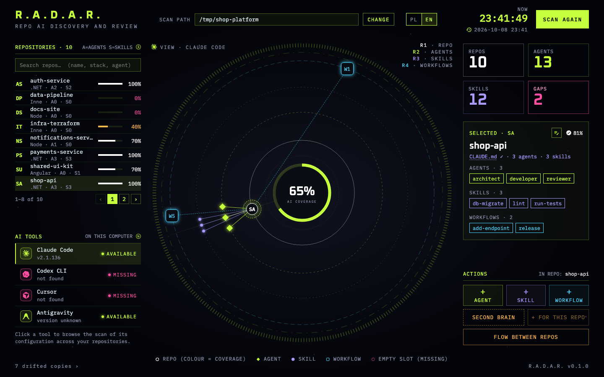
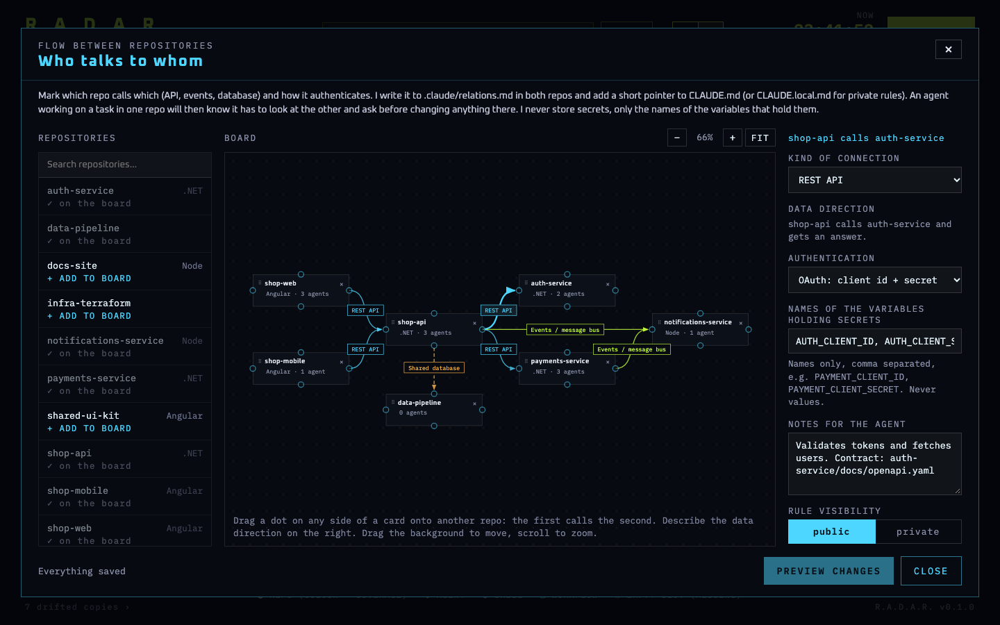

<p align="center">
  
</p>

# R.A.D.A.R.

**Repo AI Discovery And Review: a local dashboard that shows how well your repositories are set up for AI coding agents, where the gaps are, and how repos talk to each other.**

**Website:** [radar.licodero.pl](https://radar.licodero.pl) · **Install:** [one sentence to your agent](#install) · **Issues:** [report a bug or idea](https://github.com/LICODERO/radar/issues/new/choose)


Claude Code and Codex CLI do their best work in repositories that tell them how things are done: a `CLAUDE.md` with real commands, agents with clear descriptions, skills and workflows for the procedures you repeat. Most repos have some of that, in various states of repair, and nobody knows which. R.A.D.A.R. scans a folder of repositories and shows what each one has, **rates the quality of those files, not just their presence**, lists the gaps, and hands you ready commands to fill them with Claude Code or Codex CLI.

Everything runs on your machine. The server binds `127.0.0.1`, the scan is read-only, and the app makes no network calls and sends no telemetry. It writes into a repository only after it has shown you what it will write and you have confirmed it.

## Screenshots

### The orbit

Repositories, agents, skills and workflows on concentric rings. Colour shows coverage, a click lights up the relations, and the panel on the right lists what the selected repo has and what it is missing:



### Flow between repos

Draw which repo calls which, how it authenticates and which way the data goes. The rules are written to **both** repos, with a short pointer in `CLAUDE.md`, so an agent working on a feature in one repo knows it has to look at the other, and asks before it changes anything there:



## What it does

- **Finds repositories** under a folder (recursive, default depth 4) and detects the stack.
- **Scans each one** for `CLAUDE.md`, agents (`.claude/agents`), skills (`.claude/skills`) and workflows (`.claude/workflows`).
- **Scores coverage and quality.** Coverage says what exists; quality says whether it is worth anything: a thin or stale `CLAUDE.md`, references to files that are gone, an agent without a description, duplicate names. Every file gets a 0–100 score and a concrete hint.
- **Lists the gaps** and gives you ready commands for Claude Code and Codex CLI. One click opens a terminal in the repo, after you confirm.
- **Drafts agents, skills and workflows** from a description in plain words (one small `claude -p` call with no tools), copies shared ones between repos, and keeps private ones out of git.
- **Second brain:** a vault of markdown notes outside your repositories, wired into each project through `CLAUDE.local.md`, so the agent can read it and git sees nothing.
- **Flow between repos** (above): rules for who talks to whom, kept in the repos themselves.
- **Bilingual UI** (Polish and English), with `prefers-reduced-motion` respected.

### Coverage

Per repository, coverage is the sum of:

| Element | Weight |
|---|---|
| `CLAUDE.md` | 40 |
| at least one agent | 30 |
| at least one skill | 30 |

Colour on the orbit: 70 and above white, 40–69 amber, below 40 magenta.

## Install

Requires nothing but a terminal. Claude Code or Codex CLI on your `PATH` are only needed for the buttons that draft files or open sessions.

### Hand it to your agent (easiest)

You are probably already in a coding agent. Paste this and let it do the install:

```text
Read https://raw.githubusercontent.com/LICODERO/radar/main/AGENT_INSTALL.md and set up R.A.D.A.R. for me: run the steps, verify the checksum, and tell me how to start it.
```

[AGENT_INSTALL.md](AGENT_INSTALL.md) tells the agent to read the installer, run it, verify the result and report back. It forbids `sudo`, edits to your shell profile and installing anything else.

### One command

```bash
# macOS / Linux
curl -fsSL https://raw.githubusercontent.com/LICODERO/radar/main/install.sh | sh
```

```powershell
# Windows (PowerShell)
irm https://raw.githubusercontent.com/LICODERO/radar/main/install.ps1 | iex
```

The scripts ([install.sh](install.sh), [install.ps1](install.ps1)) are short; they download the archive for your system from the [latest release](https://github.com/LICODERO/radar/releases/latest), **stop if the SHA256 checksum does not match**, and unpack it into `~/.radar/app`. No administrator rights needed. Run `radar` to start; it opens `http://127.0.0.1:5178`.

### More ways

Download by hand, run from source, update and remove: see **[INSTALL.md](INSTALL.md)**. The binaries are not code-signed (no paid certificates), so a *browser* download triggers macOS Gatekeeper or Windows SmartScreen; the installers avoid that because a file fetched from a terminal carries no "downloaded from the internet" mark. INSTALL.md explains both cases.

## How it stays safe

A tool that touches your repositories has to be careful. The rules, kept by the code and covered by tests (details in [SECURITY.md](SECURITY.md)):

- Listens on `127.0.0.1` only, needs a per-session token and checks the `Host` and `Origin` headers, so other websites cannot reach it.
- Makes no network calls while running. No telemetry, accounts or background updates; the fonts are bundled.
- Reads only AI and markdown files, never `.env` or keys, and every path is resolved and checked to lie inside a detected repository (no symlink escapes).
- Writes only after you have seen the exact plan and confirmed it: a new agent, skill or workflow file, marked blocks in `CLAUDE.local.md` and `CLAUDE.md`, and entries in `.git/info/exclude`. A write is all-or-nothing, never overwrites, and the app never makes commits.
- The server builds every command it runs and every text it writes. The browser sends identifiers of ready templates, never text to execute.
- Flow rules hold the **names** of environment variables, never their values.

## Develop

You need the .NET SDK 10 and Node.js 22.

```bash
./run.sh            # build the UI if needed and start the app on http://127.0.0.1:5178 (Windows: ./run.ps1)
./dev.sh            # dotnet watch + ng serve on http://localhost:4200
dotnet test         # scanner and server tests
cd src/web && npm test -- --watch=false      # UI tests
```

`npm start` in `src/web` with `?mock` in the URL runs the UI on sample data without the server. Stack: an ASP.NET Core minimal API with server-sent events for scan progress (`src/api`), an Angular UI with signals (`src/web`), JSON files for state. [CLAUDE.md](CLAUDE.md) documents the architecture and conventions; [CONTRIBUTING.md](CONTRIBUTING.md) is the short version for contributors.

The last scan and your settings live in `~/Library/Application Support/RADAR` (macOS), `%APPDATA%\RADAR` (Windows) or `~/.local/share/radar` (Linux).

## Roadmap

- Done: orbit view, scanner, quality scoring, gap commands, agent/skill/workflow drafts, visibility (public vs private files), second brain, flow between repos, release binaries and installers.
- Later: markdown editor with templates, a presentation of the second brain, global agents and skills, scan history.

## License

[MIT](LICENSE). Third-party components are listed in [THIRD-PARTY-NOTICES.md](THIRD-PARTY-NOTICES.md).

Made by Łukasz Antoniak at [Licodero](https://github.com/LICODERO).
